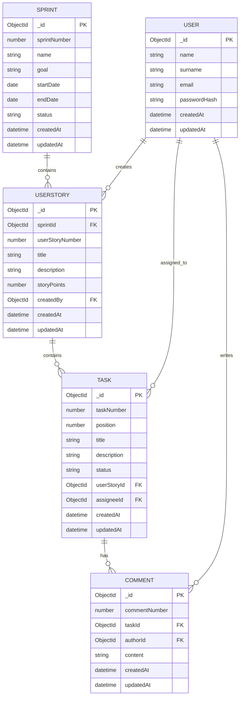

# SCRUMiGO

## Database Model

```mermaid
erDiagram
    USER {
        ObjectId _id PK
        string name
        string surname
        string email
        string passwordHash
        datetime createdAt
        datetime updatedAt
    }

    SPRINT {
        ObjectId _id PK
        number sprintNumber
        string name
        string goal
        date startDate
        date endDate
        string status
        datetime createdAt
        datetime updatedAt
    }

    USERSTORY {
        ObjectId _id PK
        ObjectId sprintId FK
        number userStoryNumber
        string title
        string description
        number storyPoints
        ObjectId createdBy FK
        datetime createdAt
        datetime updatedAt
    }

    TASK {
        ObjectId _id PK
        number taskNumber
        number position
        string title
        string description
        string status
        ObjectId userStoryId FK
        ObjectId assigneeId FK
        datetime createdAt
        datetime updatedAt
    }

    COMMENT {
        ObjectId _id PK
        number commentNumber
        ObjectId taskId FK
        ObjectId authorId FK
        string content
        datetime createdAt
        datetime updatedAt
    }

    SPRINT ||--o{ USERSTORY : contains
    USER ||--o{ USERSTORY : creates

    USERSTORY ||--o{ TASK : contains
    USER ||--o{ TASK : assigned_to

    TASK ||--o{ COMMENT : has
    USER ||--o{ COMMENT : writes
```