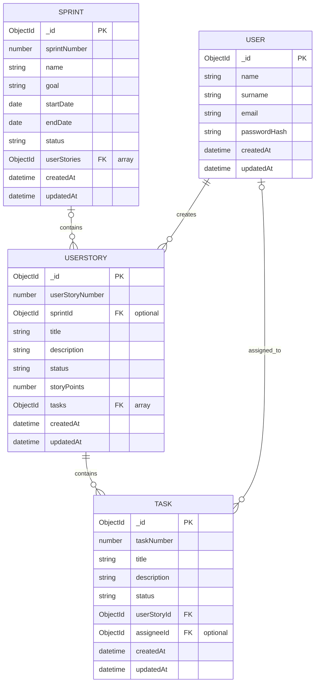

# SCRUMiGO

***SCRUMiGO*** is a simple SCRUM collaboration app, with a sprint board that supports tracking the work progress of multiple users.

## Additional Information

### Data Model

### Tools Used

[Figma](https://www.figma.com/)\
[Visual Studio Code](https://code.visualstudio.com/)\
[Adobe Photoshop](https://www.adobe.com/products/photoshop.html)\
[ChatGPT 5.6-Sol](https://chatgpt.com/)\
[MongoDB Compass](https://www.mongodb.com/products/tools/compass)\
[Postman](https://www.postman.com/)

### Resources Used

[MDN Web Docs](https://developer.mozilla.org/en-US/)\
[W3Schools](https://www.w3schools.com/)\
[StackOverflow](https://stackoverflow.com/)\
[HeroUI](https://heroui.com/)\
[Tailwind](https://v3.tailwindcss.com/)\
[Lucide Icons](https://lucide.dev/icons/)\
[Vite](https://vite.dev/)\
[React](https://react.dev/)\
[React Router](https://reactrouter.com/)\
[DNDKit](https://dndkit.com/)\
[Express.js](https://expressjs.com/)\
[MongoDB](https://www.mongodb.com/)\
[Mongoose](https://mongoosejs.com/)
